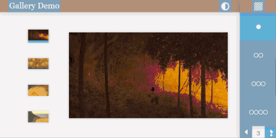

# ChronoLog

Image viewer for sequential pages of scans, with support for multiple versions of a page, each scanned on a different date. Generic image gallery demo at [demo.ejbarlow.co.uk](https://demo.ejbarlow.co.uk:3000).

Bootstrapped with [Create React App](https://github.com/facebook/create-react-app).

## Scripts

### `yarn start`

Runs ChronoLog in the development mode.

Open [http://localhost:3000](http://localhost:3000) to view it in the browser.

### `yarn create-manifest`

Fetches image details from a root directory and generates a manifest JSON file.

See `/utils/createScanManifest.js` for more details.

### `yarn patch-api`

Fixes a compatibility issue by modifying the webpackConfig of `react-scripts` to disable `useTypescriptIncrementalApi` in `ForkTsCheckerWebpackPlugin`.

See `/utils/createScanManifest.js` for more details.

### `yarn lint`

Runs eslint on the source. Ignores `./utils/`, which contains the Node utility scripts. ChronoLog uses the `airbnb` config, with additional packages for typescript and react hooks support.

### `yarn build`

Builds ChronoLog for production to the `build` folder.

Optimised, minified, in production mode & ready for deployment.

### `yarn eject`

Abandon create-react-app and react-scripts for customisable config. 
